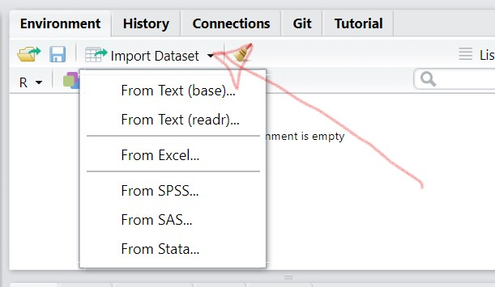
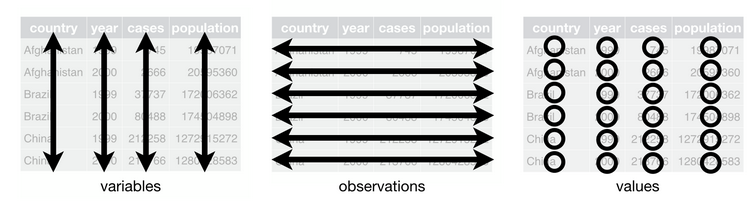

background-image: url("./img/kindofabigdeal.gif")
class: center, top, inverse

# 1. Formats de données

---

### Les grands types de données

Nous pouvons classer les données sous deux grandes catégories, suivant la manière dont elles sont disponibles :

.pull-left[#### les données structurées
Données dont l'organisation définit les relations au sein d'une base de données.

**Qualité** : lisibles par la machine, compactes, faciles à analyser, manipuler et visualiser ;

**Défaut** : limitées dans leur capacité descriptive, rares, nécessitent un traitement préalables, pas toujours documentées.
]

.pull-left[#### les données non structurées
Données ne présentant pas de structure identifiable.

**Qualité** : lisibles par l'oeil humain, très abondantes, très variées, riches d'information ;

**Défaut** : difficilement lisibles par la machine (sauf à passer par du machine learning), nécessitent un important travail de tri et pré traitement, volumineuses, peu qualitatives.
]

---

background-image: url("https://media.giphy.com/media/JPrw5LZ6Qa3D2Eus3K/giphy.gif")
class: center, top, inverse

## Les données structurées

---

### Petit exercice pratique

C'est parti :
* Ouvrez Sublime Text, ou Bloc Notes ou n'importe quel éditeur de texte hors Word ;
* Tapez le bloc de texte suivant : `nom,prenom,age`
* Complétons-le ensemble en gardant la même nomenclature.

--

Puis :
* Copiez l'intégralité du bloc (Ctrl + A / Ctrl + C) ;
* Dans votre console R, tapez :
```{r eval = FALSE}
read.csv(text = "collez votre bloc de texte ici")
```

Que se passe-t-il ?

---

### Les différents modes de structuration de données

Pour définir les relations entre les données, les différents formats mobilisent deux schémas principaux :

.pull-left[#### La délimitation

Les fichiers délimités utilisent certains signes pour signifier la séparation entre deux types de champs principaux : les cellules et les lignes. Ce sont les formats les plus légers et faciles à lire mais ils s'avèrent limités pour créer des bases de données relationnelles.

Le plus courant est le **CSV** (*comma separated value*) mais on trouvera aussi des TSV, SCSV (parfois appelés abusivement "CSV") et d'autres fantaisies.


]

.pull-right[#### Le balisage

Les fichiers balisés reposent sur une double structure :
* des objets ordonnés en liste ;
* des pairs "nom" / "valeur" à l'intérieur de chaque objet.

Schématiquement, chaque donnée est "étiquettée" d'un nom partagé avec les données ayant la même fonction dans les autres objets de l'ensemble. Ce qui rend ce type de fichier moins facile à lire par l'oeil humain mais beaucoup plus facile à manier de manière relationnel et peut contenir beaucoup plus de métadonnées.

Les formats les plus courants de ce type sont le **json** et le **xml**.
]

---

### Critères de choix d'un format de fichier

Tous les formats de fichiers n'ont pas les mêmes avantages. Pour vous aider à mieux comprendre comment arbitrer entre les formats disponibles, voici quelques critères :
* **interopérabilité** : propension à être réutilisable sans déperdition de données par différents logiciels ;
* **poids** : espace occupé par la collection de données sur le disque ou le serveur ;
* **enrichissement** : capacité de stockage de couches supplémentaires de données et de métadonnées ;
* **licence** : statut du format de fichier sur le plan de la propriété intellectuelle.

--

Car, de même qu'il existe des logiciels propriétaires, il existe des formats propriétaires :
* **xlsx**, **docx** et **ppt** (entre autres) sont propriétés de Microsoft via Office ;
* **psd** via Photoshop propriété de Adobe ;
* **pdf** l'était également jusqu'en 2008 (devenu depuis norme ISO) ;
* **shp** et ses formats associés (**shx** et cie) sont propriétés d'Esri via le logiciel de cartographie ArcGIS ;
* etc.

---

**Amusons nous à ouvrir les résultats d'élections présidentielles**

Nous voir ces données en format `xml`, en `excel`, en format `json` et en format `csv`, pour comprendre tout ça.

---

class: inverse, center, middle
background-image: url("./img/pdtl_22_xml.jpg")
background-size: contain

---


class: inverse, center, middle
background-image: url("./img/pdtl_22_xls.jpg")
background-size: contain


---

class: inverse, center, middle
background-image: url("./img/pdtl_22_json.jpg")
background-size: contain


---

class: inverse, center, middle
background-image: url("./img/pdtl_22_txt.jpg")
background-size: contain


---

## Les données non-structurées

Les données non structurées, c'est un peu tout le reste : le contenu de page web qu'il faudra aller récupérer et organiser, des tableaux écrits à la main qu'il faudra recopier, des pdfs scannés de travers qu'il faudra redresser et récupérer, etc.

---

# 2. Lire les données tabulaires

Si vous souhaitez travailler en puriste, vous pouvez apprendre tous les arguments des fonctions `read_csv`, `read_delim`, `read_csv2` ou `read_xl`. Les `?` seront là pour vous aider.

De mon côté, je vous suggère d'utiliser pleinement les outils à votre disposition dans **l'environnement**.



---

Manipulons ensemble un fichier `csv` :

*Faites bien attention à la façon dont vous organiser votre arborescence de fichiers !*

[Téléchargez ce fichier data/vacsi_csv]("./data/vacsi.csv")

1. Import dataset
2. From text (readr)

Navigons ensemble et une fois les réglages effectués, copions collons cela dans un script et stockons le dans notre environnement `SONPTINOM<- votre code`

---

Manipulons ensemble un fichier `xls` :

[Téléchargez ce fichier data/vacsi_idf.xls]("./data/vacsi_idf.xls")

1. Import dataset
2. From Excel

Navigons ensemble et une fois les réglages effectués, copions collons cela dans un script et stockons le dans notre environnement `SONPTINOM<- votre code`.


---

Manipulons ensemble un fichier `json` :

Attention, on n'est plus en  clic bouton.

```{r, eval=FALSE}
install.packages("jsonlite")
# puis
library(jsonlite)
```

[Téléchargez ce fichier data/vacsi_p75.json]("./data/vacsi_p75.json")

```{r, eval=FALSE}
SONPTINOM<-fromJSON("lienvertvotrefichier/vacsi_p75.json")
```

---

### Petit exercice

On a vu dans la première leçon comment aller chercher la deuxième ligne de la première colonne d'un tableau.

N'est-ce pas ?

--
**N'est-ce pas ?**

-- 
Merci. Donc allons y, 2e ligne de la 1ere colonne du tableau France entière.

--
Les trois premières lignes de la troisième colonne ?


---

background-image: url("https://media.giphy.com/media/uWzDsAsRm2X9qULHLs/giphy.gif")
class: center, top, inverse

# 3. Des données "propres"

---

## Pourquoi "nettoyer" ses données ?

Le nettoyage de données, tâche fastidieuse (50 à 80% du temps des professionnelles de la data, [selon un article du NYTimes de 2014](https://www.nytimes.com/2014/08/18/technology/for-big-data-scientists-hurdle-to-insights-is-janitor-work.html)), est nécessaire car la plupart des données sont livrées dans le format correspondant aux besoins du/de la producteur·rice et non des réutilisateur·rices.

La notion de "données propres" (*clean data*) se réfère ainsi à l'usage et non pas à un standard universel : **chaque usage d'un jeu de données par un·e utilisateur·rice amènera à des critères de *propreté* différents**.

---

### Quelques principes généraux de nettoyage

Nous pouvons néanmoins énoncer quelques généralités :
* est propre un jeu de données où chaque donnée est lue suivant **le type** attendu ;
* est propre un jeu de données où les valeurs d'une même variable répondent à **une nomenclature** stable et lisible ;
* est propre un jeu de données dont **les variables sont renseignées de manière claire et cohérente** par rapport au schéma général ;
* est propre un jeu de données où **les données utiles sont formatées de manière à pouvoir être manipulées facilement**

Quatre notions clefs vont donc nous servir de guide pour nettoyer nos données : le typage, le nommage, la complétude et le formattage.

---

### Un exemple de structure : les "tidy data"




.pull-left[Cette structure de base est le modèle proposé par *Hadley Wickham*, créateur du `{tidyverse}`, le modèle **tidy data**.

Cette approche vise à simplifier la lecture et la manipulation des données.]

.pull-right[
.right[

]
]

---

## Apprendre à regarder ses données

La première étape du nettoyage consiste à examiner ses données afin d'en connaître les traits généraux : combien de variables ? Combien de valeur par variable ? Quelle est leur distribution ? Quel rapport entretiennent-elles entre elles ? Y a-t-il des valeurs non renseignées ? Etc.

`{R base}` et le `{tidyverse}` offrent de nombreux outils d'exploration préalables qui permettent de créer des aperçus des données.

---

### head() : les premières lignes

Votre premier réflexe face à une base de données, c'est de voir *"comment elle se présente"*. Pour se faire, la fonction `head()` est un bon point d'entrée : elle propose en sortie les 6 premières observations d'un jeu de données.

Pour voir les dernières observations, vous pouvez utiliser sa fonction miroir, `tail()`. Il est possible de paramétrer le nom d'observations affichées en passant à l'argument `n` la valeur correspondante.

Jettons un oeil aux premières lignes du jeu de données 4 du Répertoire national des élu·es (ou RNE), et plus spécifiquement celui relatif aux maires [disponible sur Data.gouv.fr ou ici](https://www.data.gouv.fr/en/datasets/repertoire-national-des-elus-1/)

```{r head}
library(tidyverse)
rne4 <- read_delim("./data/rne-maires.csv", "\t", escape_double = FALSE, trim_ws = TRUE)
head(rne4)
```

---

### glimpse() : une synthèse des dimensions

Une fois ce premier aperçu parcouru, il est nécessaire de disposer d'une image plus générale. La première étape consiste à regarder les variables du jeu de données et leur type.

Le `{tidyverse}` propose pour cela une fonction très compacte et pratique : `glimpse()`. Quand un jeu de données lui est passé, `glimpse()` produit une synthèse rapide : nombre de ligne, nombre de colonne et premières valeurs pour chacune des variables à disposition ainsi que son type.

```{r glimpse}
glimpse(rne4)
```

---

### summary() : une synthèse des variables

`{rbase}` offre une fonction complémentaire de `glimpse()` avec `summary()`.

`summary()` analyse le jeu de données et, plutôt qu'un aperçu de quelques valeurs, propose une synthèse par variable (notamment des éléments de distribution). A ce titre, **`summary()` s'avère beaucoup plus adapté pour survoler un jeu de données contenant des données numériques que pour les chaînes de caractère**.


```{r summary}
summary(rne4)
```

---

### Petite pépite méconnue : skimr::skim

Issue du package skimr, la fonction skim permet d'obtenir une sorte de mélange de tout ça, avec même de petits graphiques

```{r skim}
library(skimr)
skim(rne4)
```


---

### table() : la distribution sur une variable

La distribution des valeurs est la façon dont l'ensemble des valeurs sont réparties sur la gamme des valeurs possibles dans la base de données. Il s'agit d'un outil d'analyse très utile pour les données numériques mais tout autant pour les chaînes de caractère ou les booléens.

La fonction de `{rbase}` `table()` permet de réaliser une synthèse de la distribution des valeurs pour une variable d'un jeu de données. Elle prend pour argument la base de données suivie de `$nomdelavariable`. Par exemple, si nous souhaitons connaître la distribution des `Libellé de la catégorie socio-professionnelle`, nous pouvons appeler cette fonction de la manière suivante :

```{r table}
rne4 <- rename(rne4, c("csp"="Libellé de la catégorie socio-professionnelle")) # d'abord, renommons cette variable relou
table(rne4$csp)
```


---

### is.na() : la présence de NAs

Pour savoir si une valeur correspond à une type de données, `{rbase}` propose une série de fonction de test : `is.*()` : `is.numeric()`, `is.logical()` ... et `is.na()` pour savoir si la valeur est NA ou non.

En la combinant avec `table()`, nous obtenons une synthèse sur le nombre de TRUE et de FALSE :
```{r table_is.na}
table(is.na(rne4$`Libellé de la collectivité à statut particulier`))
```

Nous avons donc bien un problème sur cette variable, qu'on dira *"mal renseignée"*.

**Tester une variable avec `is.na()` est une vérification de complétude souvent utile avant d'utiliser une variable.**

On peut réimporter le jeu de données en forçant le type de données attendu.
En l'occurence, le libellé doit être un character et non un booléen.

---

### Mesurer les éléments

Plusieurs foncitons permettent de connaître la longueur d'un objet dans R :
* `length()` : pour la longueur d'un vecteur ;
* `nrow()` / `ncol()` : pour le nombre de ligne ou colonne d'un dataframe ;
* `nchar()` : pour le nombre de caractères d'une chaîne de caractère.


```{r n_row_char}
length(rne4$`Libellé de la commune`)
nrow(rne4)
nchar(rne4$`Libellé de la commune`)
```


---

### Aparté : les tests 1/2

L'informatique repose en grande partie sur les valeurs booléennes : TRUE / FALSE, 1 / 0, etc. Ce type de valeur a de nombreuses qualités : elle s'avère facile à produire, lire, stocker et sans risque d'ambiguïté.

Un *test* est une opération par laquelle une propriété est évaluée sur un objet : si la propriété est remplie, le test sera dit *"vrai"* (*TRUE*), sinon, il sera dit *"faux"* (*FALSE*). Ce sont des questions fermées.

Les tests de base sont réalisés avec les opérateurs dits logiques :
* égalité `==` ;
* supérieur ou égal `>=` / inférieur ou égal `<=` ;
* strictement supérieur `>` / strictement inférieur `<` ;
* différent `!=`.

```{r test}
5 > 2
```

Il existe de nombreuses fonctions permettant de réaliser des tests (notamment les fonctions `is.*()` évoquées dans la slide précédente).

---

### Aparté : les tests 2/2

La plupart des outils que nous manipulons en R procède par des tests implicites ou explicitent. Nous pourrions résumer le principe par la question :
*"Faut-il appliquer l'opération à l'élément de rang N ?"*

Aquoi l'on peut répondre par oui ou par non.

En R, quand un test est réalisé sur un vecteur, il renvoie un vecteur de même longueur dont chaque valeur est le résultat du test sur la valeur du vecteur d'origine. Par exemple :
```{r test_vecteur}
vecteur <- c(3,1,9,15,22)
vecteur > 10
```
